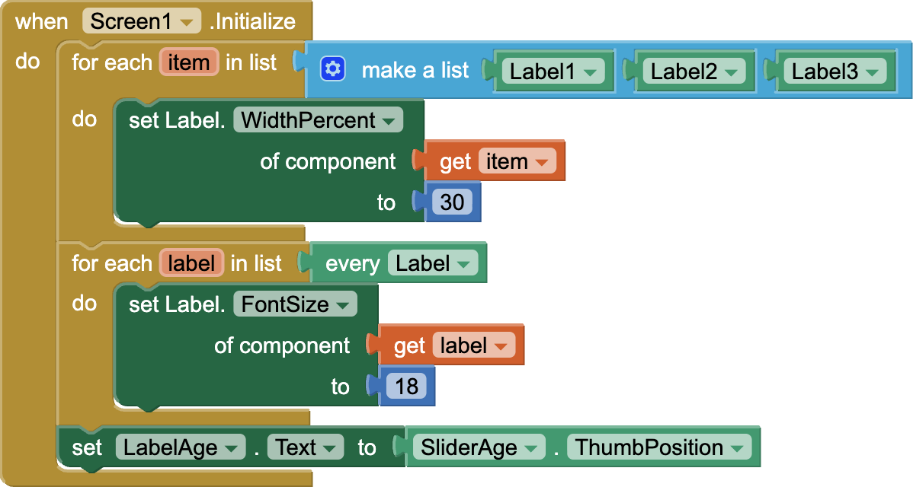
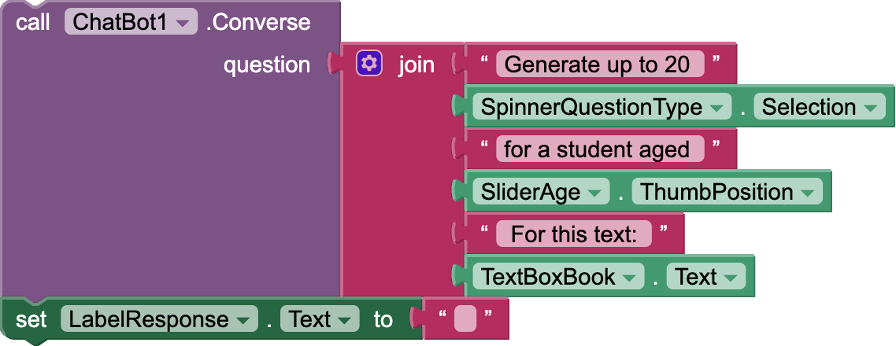
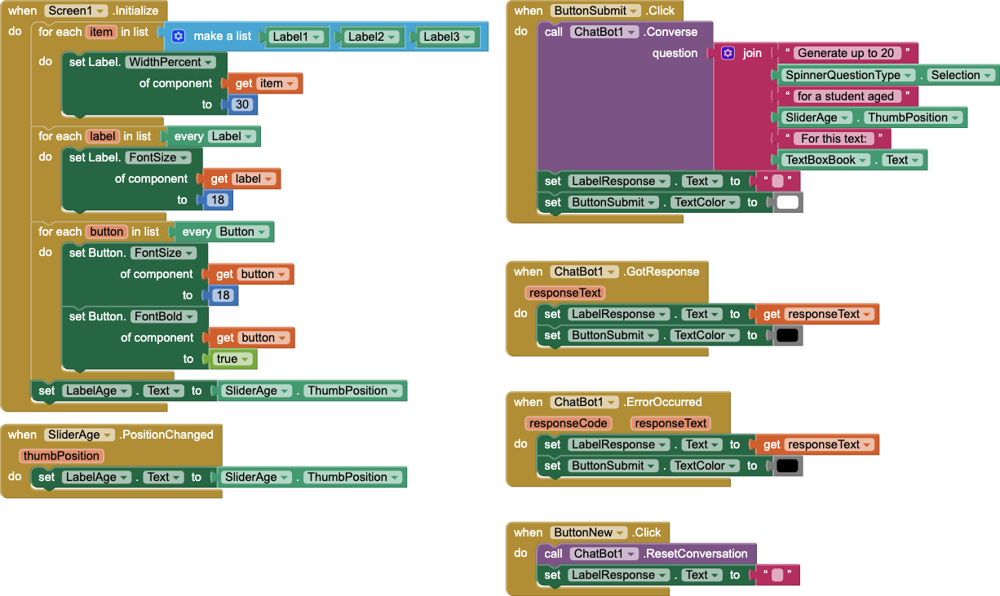
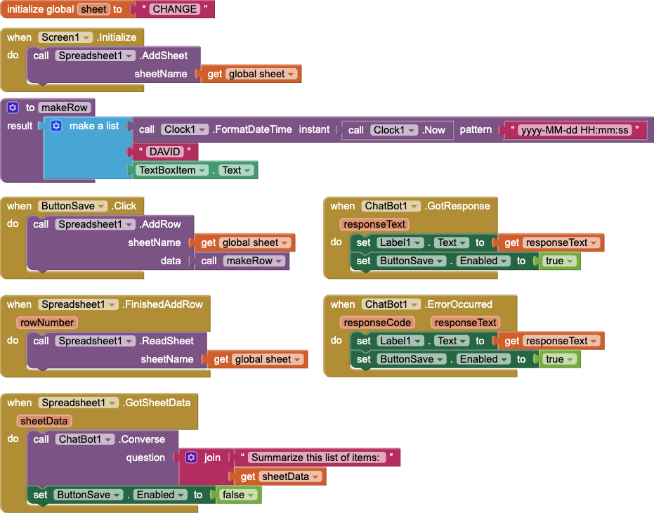

# 2026-tx-csta

## About these apps

These apps are starter [MIT App Inventor](http://ai2.appinventor.mit.edu/) apps as presented at the [2026 Texas CSTA Regional Conference](https://docs.google.com/document/d/1s8OYp63AiIemV9x0erBY7EYnq_CWUQXRzCJBEfejxKU/). The slides accompanying this presentation are available at [https://aif.to/2026-tx-csta](https://aif.to/2026-tx-csta).

## Apps

| App | .AIA | Description |
| --- | --- | --- |
| Doodle | <a href="https://code.appinventor.mit.edu/?repo=https://raw.githubusercontent.com/dcpetty/mit-app-inventor/refs/heads/main/2026-tx-csta/DoodleStarter.aia"><code>DoodleStarter.aia</code></a> | A basic drawing app. |
| Map | <a href="https://code.appinventor.mit.edu/?repo=https://raw.githubusercontent.com/dcpetty/mit-app-inventor/refs/heads/main/2026-tx-csta/MapStarter.aia"><code>MapStarter.aia</code></a> | A basic mapping app that calculates ([great circle](https://en.wikipedia.org/wiki/Great_circle)) distances between locations. |
| GoodReader | <a href="https://code.appinventor.mit.edu/?repo=https://raw.githubusercontent.com/dcpetty/mit-app-inventor/refs/heads/main/2026-tx-csta/GoodReaderStarter.aia"><code>GoodReaderStarter.aia</code></a> | Use a generative artificial intelligence [ChatBot](https://gemini.google.com/app) to encourage critical reading skills. |
| Journal | <a href="https://code.appinventor.mit.edu/?repo=https://raw.githubusercontent.com/dcpetty/mit-app-inventor/refs/heads/main/2026-tx-csta/JournalStarter.aia"><code>JournalStarter.aia</code></a> | A basic journal app crowd-sourced data in a shared [Google Sheet](https://docs.google.com/spreadsheets/d/16-hA2pixAtVlUXWVXWUHK21pBuEiZXZhDDnSW-uHg7E/). |

## Projects

The [MIT App Inventor](http://ai2.appinventor.mit.edu/) block code for the completed apps is below.

### Doodle

#### What we learned

<table class="wwl"><tr>

<td>

<h5>From the starter project in the Designer</h5>
<ul>
<li><em>Screen1</em> is set to <code>Title: Doodle</code> &mdash; as are all project titles.</li>
<li><em>Canvas1</em> is set to <code>Width: Fill Parent...</code> and <code>Height: Fill Parent...</code> to fill out the <em>Screen1</em> extent.</li>
<li><em>HorizontalArrangement1</em> is set to <code>Visible: &#x2610;</code> rendering it invisible.</li>
<li><em>HorizontalArrangement1</em> is set to <code>Width: Fill Parent...</code> for when it is made visible.</li>
</ul> 

</td>

<td>

<h5>From the completed project in the Designer</h5>
<ul>
<li>Set <em>HorizontalArrangement1</em> to <code>Visible: &#x2612;</code> rendering it visible.</li>
<li>Added <em>ButtonClear</em> to <em>HorizontalArrangement1</em> (and named it) set to <code>Text: Clear</code>.</li>
<li>Added <em>SliderWidth</em> to <em>HorizontalArrangement1</em> (and renamed it) set to <code>Width: Fill Parent...</code>, <code>MaxValue: 20</code>, <code>MinValue: 2</code>, <code>NumberOfSteps: 18</code>, and <code>ThumbPosition: 2</code>.</li>
</ul> 

<h5>From the completed project in the Blocks</h5>
<ul>
<li>The <em>Canvas1.Dragged</em> event calls <em>Canvas1.DrawLine</em> with the proper <a href="https://ai2.appinventor.mit.edu/reference/components/animation.html#Canvas">parameters</a>.</li>
<li>The <em>ButtonClear.Clicked</em> event calls <em>Canvas1.Clear</em>.</li>
<li>The <em>SliderWidth.PositionChanged</em> sets <em>Canvas1.LineWidth</em> to the <code>thumbPosition</code> parameter value.</li>
</ul> 

</td>

</tr></table>

#### Code

### Map

#### What we learned

<table class="wwl"><tr>

<td>

<h5>From the starter project in the Designer</h5>
<ul>
<li><em>Screen1</em> is set to <code>Title: Map</code> &mdash; as are all project titles.</li>
<li><em>Map1</em> is set to <code>Width: Fill Parent...</code> and <code>Height: Fill Parent...</code> to fill out the <em>Screen1</em> extent.</li>
<li><em>MarkerMcMillen</em> is set to <code>FillColor: Blue</code> (because the default is <code>Red</code>), <code>Latitude: 33.028</code> (the latitude of <a href="https://mcmillen.pisd.edu/">McMillen High School</a>, <code>Longitude:  -96.611</code> (the longitude of <a href="https://mcmillen.pisd.edu/">McMillen High School</a>), and <code>Draggable: &#x2610;</code> (so the marker will remain fixed).</li>
</ul> 

</td>

<td>

<h5>From the completed project in the Blocks</h5>
<ul>
<li>The <em>Map1.LongPressAtPoint</em> event initializes the local variable <em>pin</em> with the result of the call to <em>Map1.CreateMarker</em> using the <code>latitude</code> and <code>longitude</code> parameters.</li>
<li>With <em>Any Marker</em> from the <em>Any component</em> drawer within the local variable block, use <em>setMarker.EnableInfoBox</em> with the value of the <em>pin</em> local variable as the <code>of component</code> parameter and <code>true</code> as the <code>to</code> parameter &mdash; thereby enabling the <a href="https://ai2.appinventor.mit.edu/reference/components/maps.html#Map">infobox window display</a> when the user taps the <em>Marker</em>.</li>
<li>With <em>Any Marker</em> from the <em>Any component</em> drawer within the local variable block, use <em>setMarker.Title</em> with the value of the <em>pin</em> local variable as the <code>of component</code> parameter and a <em>Text</em> <em>join</em> of two values as the <code>to</code> parameter: <ul><li>the rounded result of a call to <em>Marker.DistanceToPoint</em> from <em>Any Marker</em> in the <em>Any component</em> drawer with the value of the <em>pin</em> local variable as the <code>of component</code> parameter, the value of the <em>MarkerMcMillen.Latitude</em> property as the <code>latitude</code> parameter, and the value of the <em>MarkerMcMillen.Longitude</em> property as the <code>longitude</code> parameter and;</li><li>the text <code>" meters to McMillen"</code>.</li></ul></li>
</ul> 

</td>

</tr></table>

#### Code

### GoodReader

#### What we learned

<table class="wwl"><tr>

<td>

<h5>From the starter project in the Designer</h5>
<ul>
<li><em>Screen1</em> is set to <code>Title: GoodReader</code> &mdash; as are all project titles.</li>
<li><em>HorizontalArrangement1</em> is set to <code>Width: Fill Parent...</code> and has two components within it.

<ul>
<li><em>Label1</em> is set to <code>Text: Book / Part: </code>.</li>
<li><em>TextBoxBook</em> is set to <code>Width: Fill Parent...</code>.</li>
</ul>

</li>
<li><em>HorizontalArrangement2</em> is set to <code>Width: Fill Parent...</code> and has three components within it.

<ul>
<li><em>Label2</em> is set to <code>Text: Age: </code>.</li>
<li><em>SliderAge</em> is set to <code>Width: Fill Parent...</code>, <code>MaxValue: 18</code>, <code>MinValue: 6</code>, <code>NumberOfSteps: 12</code>, and <code>ThumbPosition: 10</code>.</li>
<li><em>Label2</em> is set to <code>Text: Age</code>.</li>
</ul>

</li>
<li><em>HorizontalArrangement3</em> is set to <code>Width: Fill Parent...</code> and has two components within it.

<ul>
<li><em>Label3</em> is set to <code>Text: Type: </code>.</li>
<li><em>SpinnerQuestionType</em> is set to <code>Width: Fill Parent...</code> and <code>ElementsFromString: Reading and comprehension questions,Writing prompts,Analysis questions</code>.</li>

</ul>

</li>
<li><em>LabelResponse</em> is set to <code>Width: Fill Parent...</code>, <code>Text:</code>.</li>
<li><em>ChatBot1</em> is set with an <code>ApiKey</code> and <code>Provider: gemini</code>.</li>
</ul> 

<h5>From the starter project in the Blocks</h5>
<ul>
<li>The blocks in the <em>Screen1.Initialize</em> event illustrate several coding idioms in <a href="https://appinventor.mit.edu/">MIT App Inventor</a>:

<ul>
<li>Use of <em>for each item in list</em> from the <em>Control</em> drawer to iterate over each item of a list.</li>
<li>Using <em>Screen1.Initialize</em> to initialize user-interface component properties &mdash; rather than setting them in the designer. In this case using <em>Any Label</em> from the <em>Any component</em> drawer to set the <em>WidthPercent</em> of <em>Label1</em>, <em>Label2</em>, and <em>Label3</em> and to set the <em>FontSize</em> of <em>every Label</em> (available in <em>Any Label</em> from the <em>Any component</em> drawer).</li>
<li>Set <em>LabelAge.Text</em> to the initial <em>SliderAge.ThumbPosition</em>.</li>
</ul>

 </li>
<li>An Unconnected <em>Chatbot1.Converse</em> call illustrates the GoodReader prompt strategy using <em>SpinnerQuestionType.Selection</em>, <em>SliderAge.ThumbPosition</em>, and <em>TextBoxBook.Text</em>.
 </li>
</ul>

</td>

<td>

<h5>From the completed project in the Designer</h5>
<ul>
<li>Added <em>HorizontalArrangement4</em> set to <code>Width: Fill Parent...</code> and has two components within it:

<ul>
<li>Added <em>ButtonSubmit</em> and set to <code>Width: Fill Parent...</code> and <code>Text: Submit</code>.</li>
<li>Added <em>ButtonNew</em> and set to <code>Width: Fill Parent...</code> and <code>Text: New Reading</code>.</li>
</ul>

</li>
</ul>

<h5>From the completed project in the Blocks</h5>
<ul>
<li>Add to the <em>Screen1.Initialize</em> event a <em>for each item in list</em> block from the <em>Control</em> drawer to iterate over each item of the <em>every Button</em> list (available in <em>Any Button</em> from the <em>Any component</em> drawer) to set the <em>FontSize</em> and <em>FontBold</em> of every button.</li>
<li>Add a <em>SliderAge.PositionChanged</em> event that sets <em>LabelAge.Text</em> to <em>SliderAge.ThumbPosition</em>.</li>
<li>Add code to interact with <em>ChatBot1</em>.

<ul>
<li>Add <em>ButtonSubmit.Click</em> event to call <em>Chatbot1.Converse</em> with the prompt, to set <em>LabelResponse.Text</em> to <code>""</code> (to clear any previous response and indicate that the chatbot is 'thinking'), to set <em>ButtonSubmit.Enabled</em> to <code>false</code> (to disable the button and prevent multiple queries), and to set <em>ButtonSubmit.TextColor</em> to <code>gray</code> (to 'gray it out').</li>
<li>Add <em>ChatBot1.GotResponse</em> event to set <em>LabelResponse.Text</em> to the <code>responseText</code> parameter (to display the response), set <em>ButtonSubmit.Enabled</em> to <code>true</code> (to enable the button for the next query), and set <em>ButtonSubmit.TextColor</em> to <code>black</code>. <strong>It is vital that <em>ButtonSubmit.Enabled</em> is set to <code>true</code> in both chatbot events or the app could cease working.</strong></li>
<li>Add <em>ChatBot1.ErrorOccured</em> event to set <em>LabelResponse.Text</em> to the <code>responseText</code> parameter (to display the error), set <em>ButtonSubmit.Enabled</em> to <code>true</code> (to enable the button for the next query), and set <em>ButtonSubmit.TextColor</em> to <code>black</code>. <strong>It is vital that <em>ButtonSubmit.Enabled</em> is set to <code>true</code> in both chatbot events or the app could cease working.</strong></li>
<li>Add <em>ButtonNew.Click</em> event to call <em>Chatbot1.ResetConversation</em> and to set <em>LabelResponse.Text</em> to <code>""</code> (to clear any previous response).</li>
</ul>

</ul>

</td>

</tr></table>

#### Code

### Journal

<a href="https://dcpetty.github.io/mit-app-inventor/2026-tx-csta/">&#128279; permalink</a> 
<a href="https://github.com/dcpetty/mit-app-inventor/tree/main/2026-tx-csta">&#128230; repository</a>
<!-- 
PERMALINK: https://dcpetty.github.io/mit-app-inventor/REPO/
REPOSITORY: https://github.com/dcpetty/mit-app-inventor/tree/main/REPO
MIT APP INVENTOR: https://code.appinventor.mit.edu/?repo=https://raw.githubusercontent.com/dcpetty/mit-app-inventor/refs/heads/main/REPO/REPO.aia
-->

