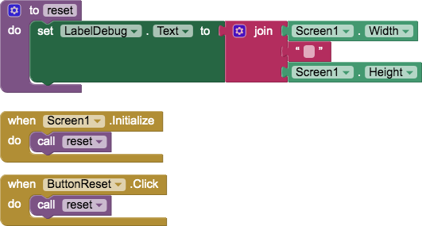

# `BlankTemplate`

## About this app

The `BlankTemplate` app is a template for *any* [MIT App Inventor](http://ai2.appinventor.mit.edu/) app. *Every* app should include a *Debug* `HorizontalArrangement` that contains a *Reset* `Button` and a *Debug* `Label`. The purpose of the *Reset* `Button` is to set the app into a known initial state. Typically `Screen1.Initialize` and `ButtonReset.Click` both invoke a *reset* procedure so that the app is in a known initial state without having to restart it. When the app is completed, simply make the *Debug* `HorizontalArrangement` not `visible`.

## Code

- The *Reset* `Button` invokes the *reset* procedure, which is a stub. It simply sets the sets the *Debug* `Label` to text showing the `Screen1.Width` and `Screen1.Height` properties &mdash; so that it does *something* visible. Change it to initialize all components and global variables.

## Designer

All components retain their default properties, &mdash; except `Width` and `Height` set to `Fill parent...` where necessary to center UX components.

<a href="https://dcpetty.github.io/mit-app-inventor/BlankTemplate/">&#128279; permalink</a> 
<a href="https://github.com/dcpetty/mit-app-inventor/tree/main/BlankTemplate">&#128230; repository</a> 
<a href="https://code.appinventor.mit.edu/?repo=https://raw.githubusercontent.com/dcpetty/mit-app-inventor/refs/heads/main/BlankTemplate/BlankTemplate.aia"><code> .AIA</code></a>
<!-- 
PERMALINK: https://dcpetty.github.io/mit-app-inventor/REPO/
REPOSITORY: https://github.com/dcpetty/mit-app-inventor/tree/main/REPO
MIT APP INVENTOR: https://code.appinventor.mit.edu/?repo=https://raw.githubusercontent.com/dcpetty/mit-app-inventor/refs/heads/main/REPO/REPO.aia
-->

