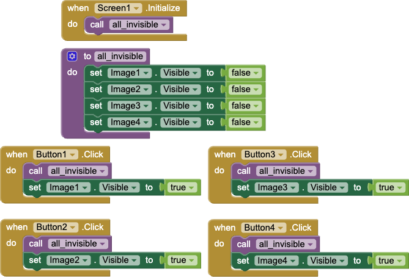

# `ButtonShow`

## About this app

The `ButtonShow` app demonstrates a low-code method for using `Button` events to make various *kitten* images visible. It demonstrates a few important computing concepts:

- Simple `Button` events tied directly to their effect.
- A property (`visible`) with a [Boolean](https://en.wikipedia.org/wiki/Boolean_data_type) value (either `true` or `false`).
- Encapsulating shared behaviors in a procedure.

## Code

- The `Screen1.Initialize` invokes the `all_invisible` procedure, which simply makes every image invisible.
- The *Button1*, *Button2*, *Button3*, and *Button4* `Button`s first invoke the `all_invisible` procedure, then make visible *Image1*, *Image2*, *Image3*, or *Image4* respectively.

## Credits

| Kitten | Credit |
| --- | --- |
| `Image1` | Photo by Patrick Slade ([https://unsplash.com/@patrickslade](https://unsplash.com/@patrickslade)) on Unsplash ([https://unsplash.com/photos/orange-tabby-cat-lying-on-white-textile-tuomgxdoIP4](https://unsplash.com/photos/orange-tabby-cat-lying-on-white-textile-tuomgxdoIP4)) |
| `Image2` | Photo by The Lucky Neko ([https://unsplash.com/@theluckyneko](https://unsplash.com/@theluckyneko) on Unsplash ([https://unsplash.com/photos/black-kitten-AtehQqKgeLs](https://unsplash.com/photos/black-kitten-AtehQqKgeLs)) |
| `Image2` | Photo by Sandra Lind ([https://unsplash.com/@sandralindh](https://unsplash.com/@sandralindh)) on Unsplash ([https://unsplash.com/photos/silver-tabby-cat-on-white-textile-niCN2DhTdlI](https://unsplash.com/photos/silver-tabby-cat-on-white-textile-niCN2DhTdlI)) |
| `Image2` | Photo by Simona Hane ([https://unsplash.com/@hanekami](https://unsplash.com/@hanekami)) on Unsplash ([https://unsplash.com/photos/a-kitten-with-blue-eyes-sitting-on-a-bed-MZA2B9MjuCM](https://unsplash.com/photos/a-kitten-with-blue-eyes-sitting-on-a-bed-MZA2B9MjuCM)) |

## Designer

All components retain their default properties, &mdash; except `Width` and `Height` set to `Fill parent...` where necessary to center UX components and `Button` text(s) changed from their defaults(s).

[&#128279; permalink](https://dcpetty.dev/mit-app-inventor/ButtonShow/), [&#128297; repository](https://github.com/dcpetty/mit-app-inventor/tree/master/ButtonShow), and [{:width="36px"} `.AIA`](https://code.appinventor.mit.edu/?repo=https://raw.githubusercontent.com/dcpetty/mit-app-inventor/refs/heads/main/ButtonShow/ButtonShow.aia) for this page.
