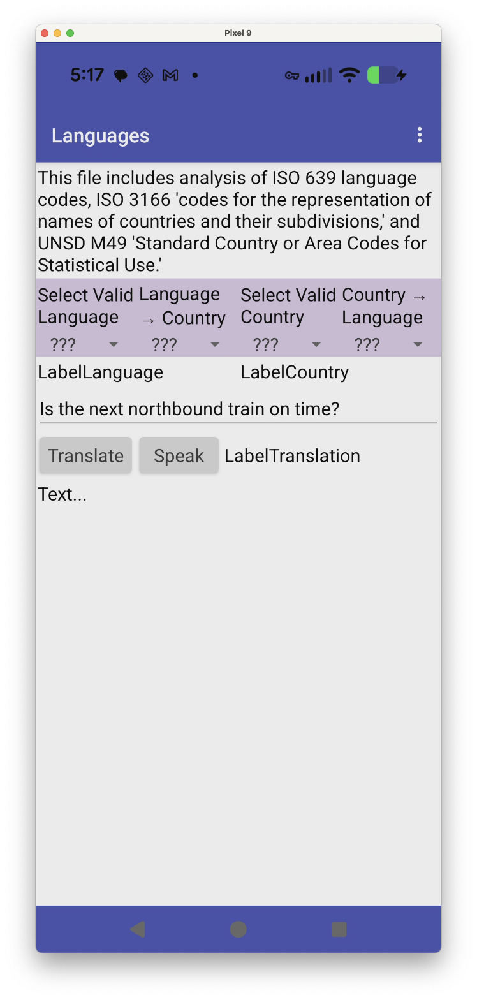

# `Languages`

## About this app

The `Languages` app is a test of [ISO 639](https://en.wikipedia.org/wiki/List_of_ISO_639_language_codes) languages, [ISO 1366](https://en.wikipedia.org/wiki/ISO_3166) countries, and [UNSD M49](https://unstats.un.org/unsd/methodology/m49/) regions supported by the [Translator](https://ai2.appinventor.mit.edu/reference/components/media.html#Translator) and [TextToSpeech](https://ai2.appinventor.mit.edu/reference/components/media.html#TextToSpeech) [MIT App Inventor](http://ai2.appinventor.mit.edu/) components (as described in [iso.ipynb](https://github.com/dcpetty/google-colaboratory/blob/main/iso/iso.ipynb)).

This work was inspired by a [Github gist](https://gist.github.com/missinglink/ebe8ba69e58dbdfb47750f6079364ecc) posted by [missinglink](https://github.com/missinglink). The additional wrinkle is that (a) the `AvailableCountries` property of the [TextToSpeech](https://ai2.appinventor.mit.edu/reference/components/media.html#TextToSpeech) component returns [ISO 3166-1 Alpha-3](https://en.wikipedia.org/wiki/ISO_3166-1_alpha-3) codes and (b) some of those codes are for *regions*, not simply countries.

## Use

The use of the <code>Languages</code> app follows these basic steps:
<ul> 
<li>Use <em>Select Valid Language</em> (with <em>SpinnerL</em>) then <em>Language &rarr; Country</em> (with <em>SpinnerL2C</em>) to set a valid country for a given language OR <em>Select Valid Country</em> (with <em>SpinnerC</em>) then <em>Country &rarr; Language</em> (with <em>SpinnerC2L</em>) to set a valid language for a given country.</li>
<li>Use <em>Translate</em> to translate the <em>TextBox1.Text</em> sample sentence from the default language (<em>e.g.</em> <code>en</code>) to the last-selected language. The sample sentence can be modified in the textbox.</li>
<li>Use <em>Speak</em> to speak the translated sample sentence in the last-selected language of the last-selected country.</li>
</ul>

### Component-level description

- When first clicked, the *SpinnerL.Elements* property is set to the *TextToSpeech1.AvailableLanguages* property &mdash; which cannot happen in *Screen1.Initialize* because the *AvailableLanguages* property is not yet available during initialization.
- When an available language is selected from *SpinnerL*, the *SpinnerL2C.Elements* property is set to the list of countries listed in the `country_lookup` key in [`iso-data.json`](https://github.com/dcpetty/google-colaboratory/blob/main/iso/iso-data.json) that match the *TextToSpeech1.AvailableCountries* property *for that selected language*.
- When first clicked, the *SpinnerC.Elements* property is the *TextToSpeech1.AvailableCountries* property &mdash; which cannot happen in *Screen1.Initialize* because the *AvailableCountries* property is not yet available during initialization. 
- When an available country is selected from *SpinnerC*, the *SpinnerC2L.Elements* property is set to the list of languages listed in the `language_lookup` key in [`iso-data.json`](https://github.com/dcpetty/google-colaboratory/blob/main/iso/iso-data.json) that match the *TextToSpeech1.AvailableLanguages* property *for that selected country*.
- When *ButtonTranslate* is clicked (and based on which [Spinner](https://ai2.appinventor.mit.edu/reference/components/userinterface.html#Spinner) was last clicked), *Translator1.RequestTranslation* is called with the first two characters **only** ([ISO 639](https://en.wikipedia.org/wiki/List_of_ISO_639_language_codes)) of the *Selection* property of the last-clicked of *SpinnerL* or *SpinnerL2C* as the `languageToTranslate` parameter and *TextBox1.Text* as the `textToTranslate` parameter.
- When *ButtonSpeak* is clicked (and based on which [Spinner](https://ai2.appinventor.mit.edu/reference/components/userinterface.html#Spinner) was last clicked), three things happen:
  - *TextToSpeech1.Language* is set to the *Selection* property of the last-clicked of *SpinnerL* or *SpinnerL2C*
  - *TextToSpeech1.Country* is set to the *Selection* property of the last-clicked of *SpinnerC* or *SpinnerC2L*
  - *TextToSpeech1.Speak* is called with *LabelTranslation.Text* as the `message` parameter.

Further explanation [TK](https://en.wikipedia.org/wiki/To_come_(publishing))&hellip;

## Code

## JSON files

- [`iso-3166-countries.json`](https://github.com/dcpetty/google-colaboratory/blob/main/iso/iso-3166-countries.json) &mdash; 301 ISO 3166 languages
- [`iso-639-languages.json`](https://github.com/dcpetty/google-colaboratory/blob/main/iso/iso-639-languages.json) &mdash;  7929 ISO 639 languages
- [`iso-data.json`](https://github.com/dcpetty/google-colaboratory/blob/main/iso/iso-data.json) &mdash; collected and tagged language (key `country_lookup`) and country (key `language_lookup` ) data
- [`unsd-m49-categories.json`](https://github.com/dcpetty/google-colaboratory/blob/main/iso/unsd-m49-categories.json) &mdash; 36 M49 regions
- [`codes.json`](https://gist.github.com/dcpetty/a41f2834f3a66c890fff91db0073ae83) &mdash; matches 251 country / language codes in [`codes.json`](https://gist.github.com/missinglink/ebe8ba69e58dbdfb47750f6079364ecc).

## Designer

All components retain their default properties, except for some default `Text` properties set to their component names. This app takes an approach to component properties that sets everything up at runtime with a `setup` procedure.

<a href="https://dcpetty.github.io/mit-app-inventor/Languages/">&#128279; permalink</a> 
<a href="https://github.com/dcpetty/mit-app-inventor/tree/main/Languages">&#128230; repository</a> 
<a href="https://code.appinventor.mit.edu/?repo=https://raw.githubusercontent.com/dcpetty/mit-app-inventor/refs/heads/main/Languages/Languages.aia"><code> .AIA</code></a>
<!-- 
PERMALINK: https://dcpetty.github.io/mit-app-inventor/REPO/
REPOSITORY: https://github.com/dcpetty/mit-app-inventor/tree/main/REPO
MIT APP INVENTOR: https://code.appinventor.mit.edu/?repo=https://raw.githubusercontent.com/dcpetty/mit-app-inventor/refs/heads/main/REPO/REPO.aia
-->

