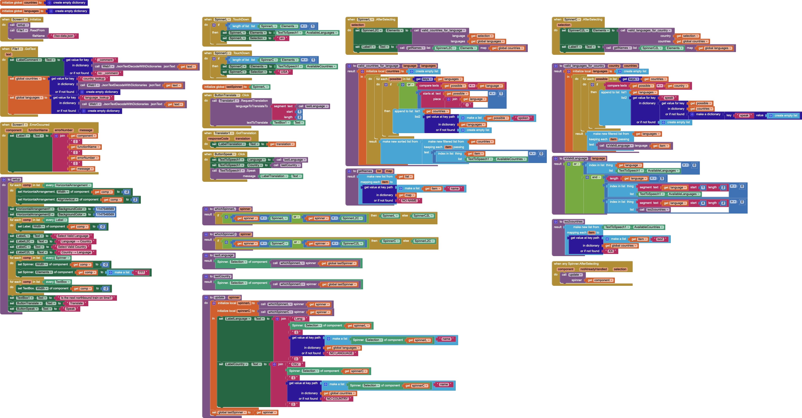
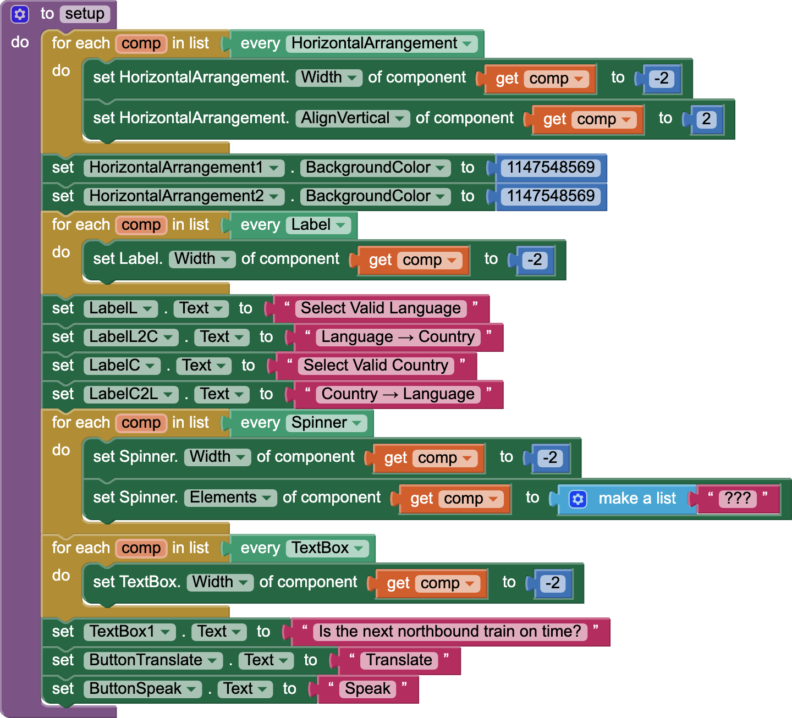

# `Languages`

## About this app

The `Languages` app is a test of [ISO 639](https://en.wikipedia.org/wiki/List_of_ISO_639_language_codes) languages, [ISO 1366](https://en.wikipedia.org/wiki/ISO_3166) countries, and [UNSD M49](https://unstats.un.org/unsd/methodology/m49/) regions supported by the [Translator](https://ai2.appinventor.mit.edu/reference/components/media.html#Translator) and [TextToSpeech](https://ai2.appinventor.mit.edu/reference/components/media.html#TextToSpeech) [MIT App Inventor](http://ai2.appinventor.mit.edu/) components (as described in [iso.ipynb](https://github.com/dcpetty/google-colaboratory/blob/main/iso/iso.ipynb)).

## Code

- The *SpinnerL* `Spinner` invokes &hellip; ([TK](https://en.wikipedia.org/wiki/To_come_(publishing)))
- The *SpinnerC* `Spinner` invokes &hellip; ([TK](https://en.wikipedia.org/wiki/To_come_(publishing)))

## Designer

All components retain their default properties, except for some default `Text` properties set to their component names. This app takes the approach to component properties that sets them up at runtime with a `setup` procedure.

<a href="https://dcpetty.github.io/mit-app-inventor/Languages/">&#128279; permalink</a> 
<a href="https://github.com/dcpetty/mit-app-inventor/tree/main/Languages">&#128230; repository</a> 
<a href="https://code.appinventor.mit.edu/?repo=https://raw.githubusercontent.com/dcpetty/mit-app-inventor/refs/heads/main/Languages/Languages.aia"><code> .AIA</code></a>
<!-- 
PERMALINK: https://dcpetty.github.io/mit-app-inventor/REPO/
REPOSITORY: https://github.com/dcpetty/mit-app-inventor/tree/main/REPO
MIT APP INVENTOR: https://code.appinventor.mit.edu/?repo=https://raw.githubusercontent.com/dcpetty/mit-app-inventor/refs/heads/main/REPO/REPO.aia
-->

