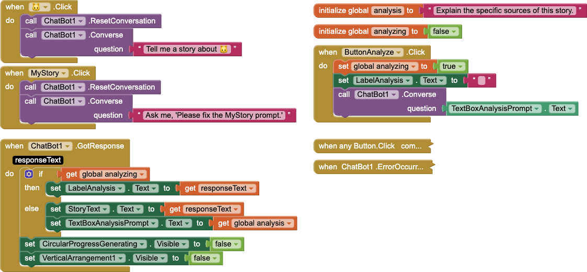

# `StoryGPTAnalyze2Starter`

## About this app

The `StoryGPTAnalyze2Starter ` app is a starter file for the *StoryGPT with Analysis (2 `Button`s)* tutorial.

This starter file can be loaded directly into [`code.appinventor.mit.edu`](https://code.appinventor.mit.edu) with [`https://aif.to/sga2s-code `](https://aif.to/sga2s-code) &mdash; a short link for <code><a href="https://code.appinventor.mit.edu/?repo=https://raw.githubusercontent.com/dcpetty/mit-app-inventor/refs/heads/main/StoryGPTAnalyze2Starter/StoryGPTAnalyze2Starter.aia">https://code.appinventor.mit.edu/&#8203;?repo=https://&#8203;raw.githubusercontent.com/&#8203;dcpetty/&#8203;mit-app-inventor/&#8203;refs/&#8203;heads/&#8203;main/&#8203;StoryGPTAnalyze2Starter/&#8203;StoryGPTAnalyze2Starter.aia</a></code>, where:

- `?repo=` will open a .AIA files in [`code.appinventor.mit.edu`](https://code.appinventor.mit.edu) (if already logged in);
- <code>https://&#8203;raw.githubusercontent.com/&#8203;dcpetty/&#8203;mit-app-inventor/&#8203;refs/&#8203;heads/</code> is the prefix for raw Github user content for this repository;
- `main/` is the branch; and
- <code>StoryGPTAnalyze2Starter/&#8203;StoryGPTAnalyze2Starter.aia</code> is the path to the .AIA file.

## Code

- Code description [TK](https://en.wikipedia.org/wiki/To_come_(publishing)).

## Designer

- The *ChatBot1* `Chatbot` component's `APiKey`, `Provider`, and `System` properties are preset.
- All UI components retain their default properties, &mdash; except `Width` and `Height` set to `Fill parent...` where necessary to center UX components.

[&#128279; permalink](https://dcpetty.github.io/mit-app-inventor/StoryGPTAnalyze2Starter/), [&#128297; repository](https://github.com/dcpetty/mit-app-inventor/tree/master/StoryGPTAnalyze2Starter), and [{:width="36px"} `.AIA`](https://dcpetty.github.io/mit-app-inventor/StoryGPTAnalyze2Starter/StoryGPTAnalyze2Starter.aia) for this page.
